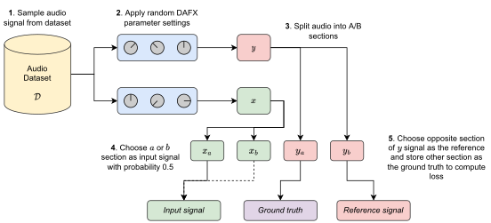

## What I've done this week
- Completed a first draft of the interim report, sent over as a separate document.
- Spent a little bit of time looking for a Linux-compatable VST3 Parametric EQ, but didn't have much luck. Unfortunately, it looks like Pedalboard has issues with VST3 modules built using the JUCE framework - I'll continue looking for something suitable!
- Didn't have time for much programming this week due to writing up the interim report and final coursework submissions, will pick this up again next week.
  - I did make a start on a toy SPSA example in PyTorch.
- Read and summarised *DrumGAN: Synthesis of Drum Sounds With Timbral Feature Conditioning Using Generative Adversarial Networks (2020)*.
  - Short summary and takeaways below.
- Updated architecture diagram to include timbral feature extraction as additional input to the VAE section.
- Created a diagram for data generation strategy.
  - Both diagrams included at the end of the report.

## Questions
- No specific project questions - any feedback on interim report draft would be appreciated (doesn't necessarily need to be in time for the meeting).

## Plan for next week
- Finish SPSA example discussed last week.
- Create small 'test' dataset using generation method, check that parameter values are sensible (i.e. not silence or just noise).
- Start implementation of data preprocessing (including AudioCommons feature extractor) and dataset loading into model.
- Start implementation of DAFX into model with SPSA.
- Second draft of interim report.

## Current state of project
- First draft of interim report submitted.
- Main focus for the next two weeks is finalising basic model implementation and training dataset.

\pagebreak
# DrumGAN: Synthesis of Drum Sounds With Timbral Feature Conditioning Using Generative Adversarial Networks (2020)

## Short Summary
In this paper, the authors present a method of generating synthesised drum sounds conditioned on high-level timbral features extracted from the Audio Commons timbre extraction model. By conditioning on these high level features, the generation process can be controlled in an interpretable way. The model itself uses a Progressive Growing Wasserstein GAN (PGAN) architecture and a large (private) dataset of kick, snare and cymbal sounds for training. A custom loss function is defined which controls audio generation based on the conditional features.

Evaluation of model performance is used by comparing Inception Score, Frechet Audio Distance and Kernel Inception Distance between the conditioned and unconditioned models. The proposed architecture is also compared against a prior method of drum synthesis called U-Net. The perceptual feature conditioning is tested by changing values of input features and comparing the change of value in the generated output (feature coherence). DrumGAN is shown to generate high-quality drum samples with the high-level features providing meaningful control over the audio generation.

## Takeaways
- I initially skipped over this paper as it didn’t seem as relevant as other papers to my project, however there are quite a few techniques which seem useful.
- In particular, the use of the AudioCommons model to create feature vectors for model conditioning is an interesting idea.
- Feature coherence seems like a very good measure of whether the conditioning on timbral features actually makes any difference to generated output. Something similar can probably be used in my project for generated parameter settings.
- Authors use radial and spherical interpolation experiments for traversing points in latent space to generate drum sounds as a qualitative experiment of coherence - may also be useful as a qualitative test in my experiments.

\pagebreak
# Updated architecture/dataset generation diagrams

## Architecture
|
| :--: |
| **Figure 1**: Updated architecture diagram including the timbral feature extractor (AudioCommons).

## Dataset Generation
|
| :--: |
| **Figure 2**: Diagram showing how the traning dataset will be generated.