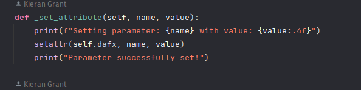
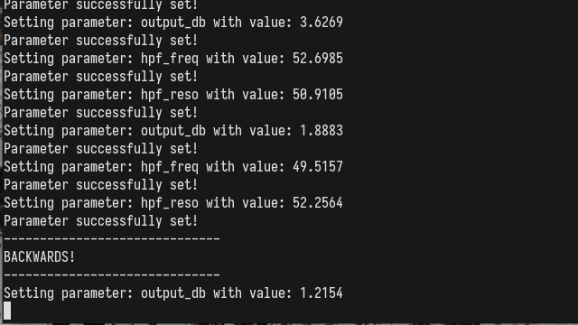

## What I've done this week
- Completed second draft of interim report with changes based on first draft feedback.
- Spent most of the week getting SPSA working with generic DAFX loaded in through Pedalboard.
  - Created a standalone Colab demo notebook ([HERE](https://colab.research.google.com/drive/1g4Pm7UKNijeA1D1M-7pDPPKsMIE-2_MI?usp=sharing)) which includes building the MDA plugins if you are interested in the implementation!
  - Set up a basic neural network to predict (multiple) parameter settings for one of the MDA effects.
  - Dummy dataset where the input is a short random noise signal, and target output is the input noise after processing through the FX with fixed parameter settings.
  - Used a simple MSE between the predicted output (input processed through effect with predicted parameters) and target output.
  - Confirmed that predicted settings converged towards initial FX settings during model training.
  - *However*, I ran into an annoying bug which means the model training only works on CPU and not on a GPU.
    - **The bug**: during the SPSA backward pass, the program freezes as soon as the VST object is touched (either setting parameters with `setattr` or processing audio). 
    - It's particularly strange as:
      - The forward pass works as expected.
      - The section where the DAFX parameters are updated is performed on the CPU, even in the GPU implementation.
      - SPSA was working with GPU when using one of Pedalboard's built-in effects (only predicting one parameter setting) using the same `setattr` function.
    - I tried a different virtual environment and version of Python locally, but no luck.
    - The same problem occurs in the Colab notebook when using a GPU. 
    - Added images showing the issue when running locally with some debugging print statements at end of report (debugging with breakpoints doesn't seem to work when running PyTorch on GPU).
    - Isn't the end of the world as I can still train the model on the CPU, but would obviously make life easier if I could use GPU acceleration.
- Began working on data generation and preprocessing pipelines.

## Questions
- Any feedback on the second draft of the interim report would be very much appreciated!
- If you have a chance to have a quick look at the Colab notebook and notice anything obvious which might be causing the GPU issue - I'd be grateful!
- I'm starting to think about model training and in particular the main pre-training of the model to get fixed weights for the autoencoder (since the encoder/latent-space will be used for any arbitrary DAFX with only the decoder part being retrained per effect). For this pre-training, would you advise that either:
  - Just try to reconstruct the auto-encoder inputs (the input and reference embeddings and extracted features) to create a meaningful latent space? 
  - Or would it be better to have a fixed DAFX and train the model end-to-end? 

## Plan for next week
- Hand-in interim report.
- Finish data generation and preprocessing pipeline.
- Finish end-to-end model implementation.

## Current state of project
- Interim report close to completion.
- Implementation of SPSA for generic DAFX is a good hurdle to get over.
- Still aiming to have an end-to-end model by the end of semester. Should put me in a good position for the second semester.

# SPSA Model Training GPU Bug

|
| :--: |
| **Figure 1**: Function where the model training is freezing when running on GPU.

|
| :--: |
| **Figure 2**: Console output during model training on GPU - no progress is made beyond this point.