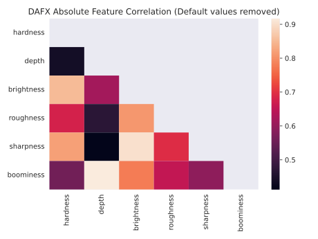
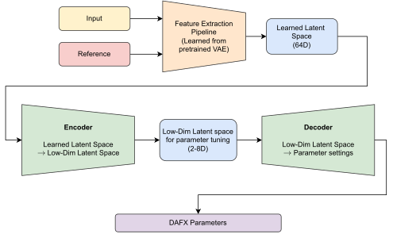

## What I've done this week
- Submitted final draft of interim report.
- Implemented data generation and preprocessing pipeline. Seems to all be working well!
  - Pipeline randomly samples a song from the MusDB dataset, takes a 5 second sample of the song and applies two different effect settings to the audio.
  - Some augmentation is also applied to the sample before DAFX processing using built-in SoX effects - just some very basic pitch shifting and time stretching to increase the variability of the training set.
  - There are checks that the output audio is not all silent, and that the transformation is sensible (using cosine similarity between original and effected MFCCs - manually tuned this by listening to some of the generated data).
  - The data generation is pretty fast as well so shouldn't be a bottleneck during training.
- Added Audio Commons feature extractor to preprocessing pipeline. A few issues with this:
  - Feature extraction is slow, even on these 5 second samples. To extract all 8 features for a single audio sample takes around 3 seconds. Considering that I was going to use a training set size of 10,000 (and each set has 2 audio samples) - this would mean an epoch would take at least 16.67 hours.
  - The extraction models themselves are not the most robust and frequently throw errors (~15% of cases for most features). I've wrapped each in a try/catch block for now which returns a default value for that feature if an error occurs.
  - To reduce the amount of time needed for feature extraction I did some analysis on the correlations and variance of each of the features to select a subset to use for training. I removed any instance where a default value was returned and also removed the 'reverb' feature as this had very little variance across all the samples.
  - Warmth had a large (negative) correlation with brightness and positive correlation with boominess so I decided to remove this feature. It was also the most flaky - returning a default value in ~60% of samples.
  - The final (absolute) correlation matrix can be found in Figure 1. I decided to use only brightness and depth for now as features to be extracted for training. This brings the feature extraction time down to ~0.5 seconds for a 5 second piece of audio - still not great, but better than extracting all features!
- Implemented a 'first draft' of training pipeline for both the $\beta$-VAE and the end-to-end system.
  - The good news is the VAE is able to be trained on the GPU as it doesn't use SPSA.
    - I performed some very short training runs to check that the VAE was learning during training.
    - A summary of one of these runs can be found here: 
      - [Link to W&B Report](https://wandb.ai/kieran-grant/Level5VAETraining/reports/VAE-Model-Training--VmlldzozMTYzOTY4?accessToken=oaaze9dtv3gr12mvhqe7d5hpwxkg6ybdmt76pckkycwj89udq5lb77oxgx3bzc2h)
    - Encouraging to see that the model seems to be learning quite quickly even on this very small dataset.
    - I used a slightly larger latent space (64-dimensions) for the VAE which can be further mapped down in the end-to-end system.
  - I then used the learned weights of the VAE encoder section in the end-to-end system.
    - Seems to load in the weights correctly and runs training end-to-end including SPSA for the DAFX.
    - I haven't implemented the 'proper' loss function (just using MSE for now) so not worth sharing the training logs.
    - Still having the same issue as last week with running model training on the GPU with SPSA. However, training on the CPU seems reasonably quick so probably not an issue.

## Questions
I would be interested to hear your thoughts on the following:

- For the VAE training, I need to use a DAFX for audio generation and I am thinking about the best way to do this:
  - Could use either no DAFX (just pitch and time-stretch augmentation) or something very transparent (compressor with only one or two parameters being changed slightly).
  - Use different DAFX at each epoch - not sure if this would make training unstable? Also not sure if the model would learn anything more than just seeing lots of examples of audio. 
- I still need to decide on exactly how to map from the learned VAE latent space down to a low-dimensional latent space then to parameter settings. A possible approach is shown in Figure 2. Though for making sure the low-dimensional latent space is sensible I will only be able to use the KL-divergence and not reconstruction loss since the output of the decoder is the parameter settings.

## Plan for next semester
- Decide on audio generation for training VAE.
- Train the VAE and perform some analysis on the learned latent space - tune the latent space dimension.
- Use learned weights for end-to-end model.
- Decide on mapping from learnt latent space to parameter settings.
- Implement sensible loss function for both the audio and the low-dimensional latent space.
- Train end-to-end model for a few different effects.

## Current state of project
- Interim report complete.
- Made good implementation progress.
- Still a few decisions to be made around model training and mapping learned latent space to DAFX parameters for each new DAFX.

|
| :--: |
| **Figure 1**: Audio Common feature correlation matrix (3715 samples across 9 different effects including compressor, distortion, reverb, delay and modulation).

|
| :--: |
| **Figure 2**: Rough idea of end-to-end training after VAE pre-training.  