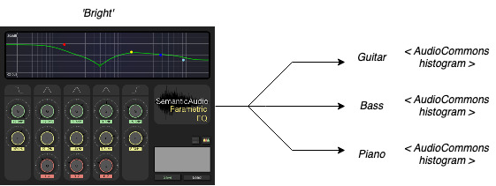

# Meeting 17/10/2022

## Minutes
- Went through slides and discussed progress in the last week.
- Discussed SAFE-DB dataset as well as flowEQ.
- Went through *A Method for Rapid Personalization of Audio Equalization Parameters (2009)* paper, and how it could relate to project.
- Sounds as though there is no completely universal way to quantify timbral qualities - but can get an idea as a starting point.

## To-do for this week 
- Decide whether to focus on audio generation, or parameter optimisation.
- Look at GLOVE embeddings/Distil-BERT on hugging face.
  - Have a think about how parameter layers could be added.
- Create a demo of SAFE-DB and Audio Commons.
  - *Example*: select a 'bright' EQ setting get AudioCommons to tag with some different instruments passing through it.
  - Maybe have one for three instruments playing the same note.
  - Then one for one instrument, but multiple notes?
    

- Think about how you could take points in the latent space with tags from Audio commons, then use that to map words into the space.
- Could use SAFE-DB dataset as a starting point when user requests a sound.
  - Let the user traverse the latent space.
  - Refine using reinforcement, NLP or something else?
  - Use some sort of user context for future settings.
  - How can you get from the sound in your head to a good setting quickly?
- Look at some of Bjorn's papers around how subjective tests could be performed.