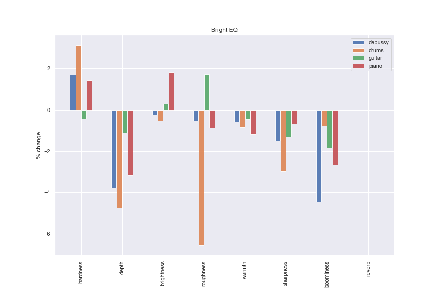

# Week 6 Report

## What I've done this week
- Read *Speaking About Sounds: A Tool for Communication on Sound Features (2017)*.
  - Similar to the AudioCommons paper on trying to create a 'dictionary' of sound terminology which generalises across domains (music production, psychoacoustics, sound design etc).
  - Authors do a literature review of 52 academic papers and use domain experts to determine 35 frequently used terms and create a 3 categories for sound features: basic (*high/low, loud/weak* etc), temporal (*continuous/discontinuous, slow/fast attack* etc) and timbral (*rough/smooth, bright/dull* etc).
  - Definitions are then created from sound design experts and reference/example sounds for each term collected.
- Read and summarised *Style Transfer of Audio Effects with Differentiable Signal Processing (2022)*
  - By the same authors as the Black-Box DDSP paper as well as the creator of flowEQ.
  - Summary and takeaways below.
  - Hugging Face space demo: https://huggingface.co/spaces/nateraw/deepafx-st
  - Also watched a video of one of the authors giving a presentation of the paper (https://www.youtube.com/watch?v=-ezTdjRpAvw). The author suggested some potential future work which might be worth exploring as part of the project:
    - Extend approach with more differentiable effects (reverb, distortion etc), can then use the model to, for example, match guitar tones.
    - Dynamic construction of processing chain - which effects are needed to match production style? This would probably require the first point to be completed.
    - Zero-shot adaptation to a new set of audio effects (can you use the effects you already have in your DAW?).
- Did another iteration of using the AudioCommons timbral extractor models to analyse the effect of applying EQs using the terms in the SAFE-DB dataset.
  - I've added an example of one of these to the end of the report.
  - Can show more of these at the meeting if they are of interest.
- Did some analysis on the SocialFX dataset, however I have yet to find a way to apply the effects from the dataset to audio in the same way as the SAFE-DB dataset.
- Thought about what inputs/outputs of the model should be and I think raw audio might be the most flexible - can still use parameter prediction within the model itself.
  - Lots of different audio losses that can be used for evaluation.
  - Apparently some issues with losses in the parameter domain (mentioned in Style Transfer paper, but I need to look at the references to get a better understanding of why). 
    - I imagine it is might be that changes to different parameters have more/less obvious perceptual effects, but it would be difficult to encapsulate this in a loss directly on the parameter values>

## Questions
- I'm starting to have doubts about whether natural language is the best way to describe sound characteristics, and whether using reference tracks and style transfer may be more quantifiable. I still believe all the reading I have done into music language will be useful, but maybe more as a counter argument to why it is quite poorly defined. I would be interested to hear feedback on this potential slight change to the aim of the project.

## Plan for next week
- Do some more reading into style transfer.
- Try to find papers relating to how reference tracks are used to describe timbre (rather than natural language).

## Current state of project
- Getting a better understanding about how useful semantic descriptors are for capturing timbral features.
- Need to spend a bit of time exploring alternatives that may be more natural.

---

# Style Transfer of Audio Effects with Differentiable Signal Processing

## Short Summary
This paper presents  a model which is able to transfer the audio effects and production style from one audio signal to another. A deep neural network is trained to analyse the two recordings and predict the parameter values of audio effects to match the audio style of the reference recording.

There are a number of novel contributions in the paper. The first is the use of differentiable audio effects (DDSP) for style-transfer and allows for backpropagation to be performed directly. Another is a strategy for self-supervised training which involves taking an audio source, applying two random audio effects to them and then splitting both into two sections. The model tries to match the style of the first/second section of the first audio signal to match the opposite section of the second audio signal. In this way a direct loss can be computed from the predicted output (after the audio effects are applied) and the ground truth - without requiring any pre-labelling of the data.

The model itself consists of an encoder part which creates a representation of the two-audio signals (input and reference), then a feed-forward network which tries to predict parameter values for the audio effects based on these encodings. The (differentiable) audio effects are applied to the input signal to produce a predicted output.

To evaluate, the method is compared against a number of other differentiation methods such as neural proxies, black-box methods and numerical approximation of gradients (SPSA). These are compared using a number of audio features across a range of unseen test datasets. The approach proposed is shown to perform the best of the differentiation methods with a relatively low inference compute cost (only slightly higher than a rule-based DSP method).

## Takeaways
- Overall I think this is a really fantastic paper, and has in particular made me think about how reference tracks are often used in a music production setting to convey ideas about *how* you want something to sound and can be much more effective than trying to convey what you mean in words.
- I really like the approach for dataset generation, though it does seem like the dataset itself is quite large (for the music production style transfer ~55k songs).
- It is also very useful that they compare a number of differentiation methods and discuss the pros and cons of each.

---
# AudioCommons/SAFE-DB figure example

|
| :--: |
| *Figure: percentage change to AudioCommon feature values after applying mean 'bright' EQ setting from the SAFE-DB dataset.* |