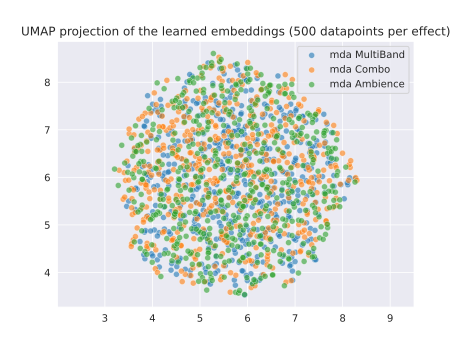

## What I've done this week
- Updated VAE training to use multiple DAFX.
  - I decided to go with changing the effect at each epoch since the overhead for instantiating the new dataset is quite low (audio is only generated when a datapoint is fetched from the dataset, not on creation of the dataset).
  - Also implemented early stopping and checkpointing for training.
  - I've set the patience of the early stopping to be the same as the number of effects to ensure validation loss has converged for all effects before halting training.
- Ran model training on the VAE.
  - Used a train set size of 250 and validation size of 25 - takes ~5 minutes per epoch. 
  - I set the maximum number of epochs to 100 with early stopping.
  - Used 6 effects during training (multi-band compression, overdrive, reverb, delay, flanger and limiter), holding out 3 effects for analysis/end-to-end model training (Leslie speaker simulator, amp simulator and a bass booster).
  - Training converged quite quickly and early stopping halted training at ~27 epochs, with the best validation loss achieved at epoch 21.
- Set up a notebook to visualise the learned latent space.
  - Use the same data generation technique as in training to get latent embeddings of audio under transformation from different types of effects.
  - Also stored the *brightness* and *depth* features from the AudioCommons extractor and the effect used.
  - Then use UMAP to map these down to a 2D plot for visualisation (see figure below).
- Read *Bridging Audio Analysis, Perception and Synthesis with Perceptually-Regulated Variational Timbre Spaces (2018)*.
  - Will require a re-read before I can create a summary (next week).

\pagebreak
### Low-dimensional projection of data after VAE training

|
| :--: |
| **Figure 1**: UMAP 2D projection of latent embeddings of 1500 paired (effected/unaffected) audio samples using three different DAFX after VAE training. The *mda MultiBand* and *mda Ambience* effects were used during training, while the *mda Combo* effect was unseen.

## Questions
- Should I be concerned that training converged so quickly? Obviously this is just the VAE part of the system, and not end-to-end style matching, but it seemed to learn a reasonable latent space within a few epochs.

## Plan for next week
- Implement the end-to-end system including correct losses.
- Create a plan for model evaluation.

## Current state of project
- VAE training seems to have gone better than I expected.
- Still need to implement the end-to-end system.
- Need a plan for evaluation.
- Would be good to start writing the final paper soon.
