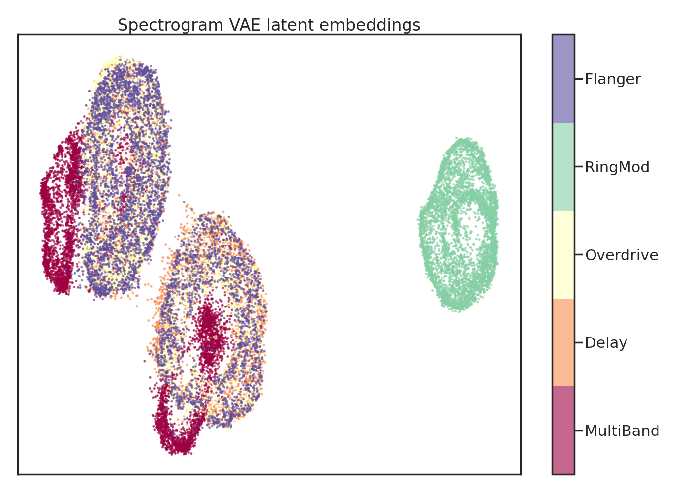
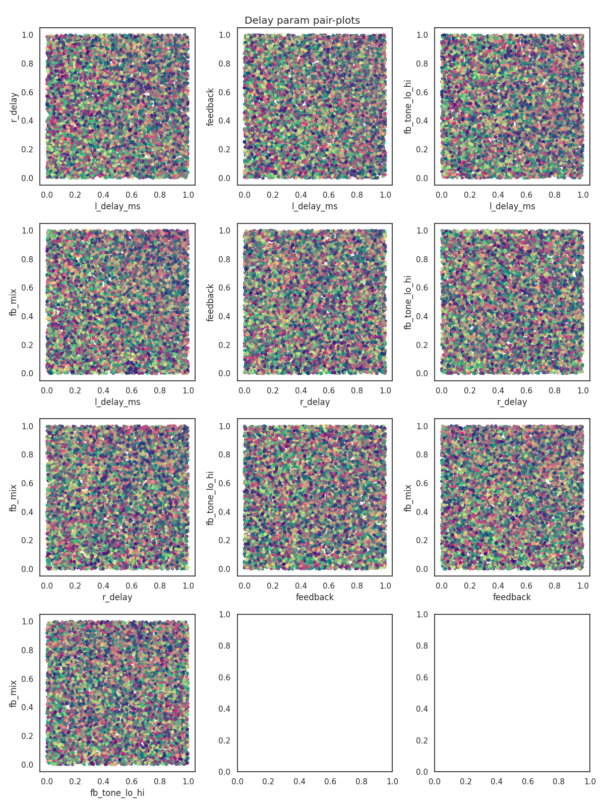
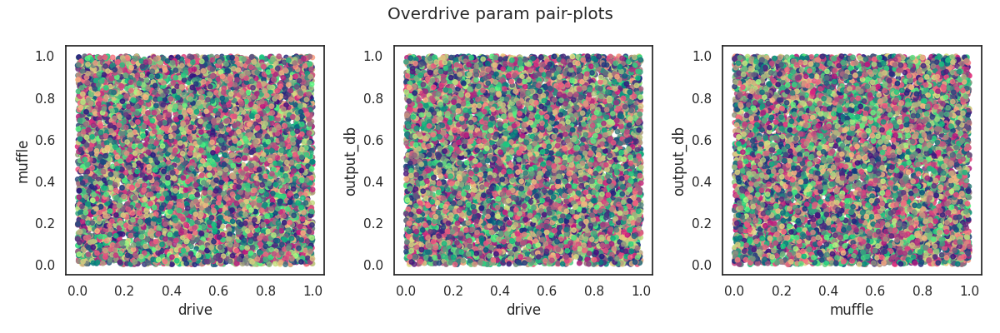

## What I've done this week
- Tried changing out Spectrograms for Mel-Spectrograms.
  - Reduced frequency range to 20Hz-12kHz with 256 Mel-frequency bins (256x256 image).
- Also implemented a VQ-VAE to potentially replace the $\beta$-VAE.
  - Reconstructions were much better, but created higher dimensional latent embeddings.
  - Actual structure of latent space was not as good as previous Spectrogram $\beta$-VAE implementations (see Figures 1-3), so I've gone back to using those for now.
- Updated End-to-End model using the best Spectrogram-VAE so far (128D latent space).
  - Concatenating input and target embedding to create 256D input vector to the network.
  - Added Layer normalisation and initialisation so the model begins by predicting ~0.5 for all parameter settings at the start of training. Seems to have fixed issue of the model getting stuck from a few weeks ago.
  - Tested with static settings for a couple of DAFX.
  - Performed training runs with random settings for 4 DAFX. You can see plots and listen to the audio clips on W&B here: [https://api.wandb.ai/links/kieran-grant/kt0ixy4s](https://api.wandb.ai/links/kieran-grant/kt0ixy4s)
- Kept working on latent controller interface.
  - Using Streamlit for the interactive plot; seems to work well!
  - User can click on datapoint in plot and the relevant audio is displayed.
  - Also created data generation pipeline to pre-compute embeddings (with various numbers of semi-supervised labels) as well as audio.

## Questions
- Do you think it is worth starting the user evaluation with what I have, with the chance that the model *might* improve in the next couple of weeks?

## Plan for next week
- Finish interface and test with expert user.
- Continue to try to improve model performance.
- Create scripts for other testing/MUSHRA.
- Continue writing report.

## Current state of project
- Implementation is almost done, still looking to improve model performance however.
- Hoping to start evaluation as soon as possible.

\pagebreak

# VQ-VAE latent space

|
| :--: |
| **Figure 1**: Latent embedding of 5 DAFX with VQ-VAE embeddings.

|{width=70%}
| :--: |
| **Figure 2**: Domain colouring pairplots for Delay with VQ-VAE embeddings.

|
| :--: |
| **Figure 3**: Domain colouring pairplots for Overdrive with VQ-VAE embeddings.
