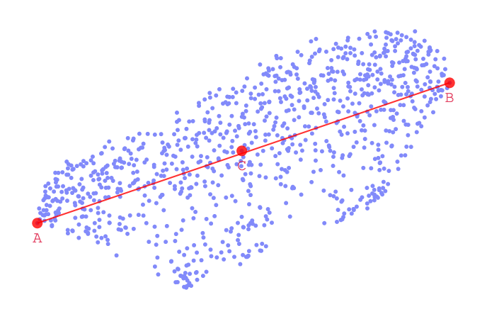

## What I've done this week
- Finished implementation of latent controller interface.
- Ran latent controller evaluation with expert user using the Overdrive and MultiBand DAFX.
  - The user was first given some time to use the interface, then I conduced 2 tests and a questionnaire.
  - In the first test the user was given two points in the 2D space and asked to consider what the midpoint would sound like (see **Figure 1**). The user was allowed to listen to the end-points and the unaffected audio as many times as they liked before hearing the midpoint. The user was then asked to rate how well the audio matched their expectation on a scale from 1 to 10. This was repeated 3 times for each effect.
  - In the second test, the user was asked to apply a particular type of effect (*"add a small amount of overdrive"*, *"make the audio sound as bright as possible"* etc). I recorded the number of attempts required from the user to apply the effect, and the user gave a rating of how easy they found it. The user was asked to apply 4 different transformations for each effect.
  - In the final questionnaire I asked about the usability and efficiency of the interface. For each question, the user was asked to give a rating from 1-10 and could provide any additional comments.
  - Overall, the user was very complimentary of the interface and the 2D sonic space made sense to them. In most cases, they were able to accurately apply an effect within a couple of attempts.
- Adapted the webMUSHRA interface from: [https://github.com/audiolabs/webMUSHRA](https://github.com/audiolabs/webMUSHRA) for my project.
  - To generate the data, I used some of Pedalboard's ([https://github.com/spotify/pedalboard](https://github.com/spotify/pedalboard)) built-in effects and applied them to the DAPS dataset (both effects and audio source unseen in training data).
  - I have used 4 different effects with 3 examples of each. For the MultiBand compressor, I also generated a style match using the model from Steinmetz et al [1] as an additional condition.
  - I've deployed the webapp; you can visit the experiment site here: [https://msci-mushra.uk/](https://msci-mushra.uk/).
  - If you have no additional comments for the site, I will open it up to human participation on Monday (I think 5-10 users would be sufficient for evaluation).
- Created scripts for running 'offline' evaluations of the model for a variety of metrics for the VTCK, DAPS and Mus18 DB datasets.

## Questions
- I would be interested to hear your feedback on the MUSHRA test. In particular:
  - Do you think there are a wide enough variety of DAFX (4) and examples per DAFX (3)?
  - Reading the ethics checklist, I think I have covered everything in terms of asking for user consent, giving contact details, and storing data in an anonymised way. Is there anything I might have missed (in particular by hosting my own web-app rather than using something like Google Forms)?
- Have there been any updates on when the presentation might be?

## Plan for next week
- Get participants for MUSHRA test.
- Report writing.

## Current state of project
- Evaluation implementation mostly done, hopefully allow the next couple of weeks for focussing on my report.

\pagebreak

# Latent Controller Experiment

|
| :--: |
| **Figure 1**: Interface for the first test of the evaluation. The user was asked to listen to points A and B and consider how they expect point C to sound. They were then asked to rate how well the audio matched their expectation.

## References

[1] Steinmetz, Christian J., Nicholas J. Bryan, and Joshua D. Reiss. "Style transfer of audio effects with differentiable signal processing." arXiv preprint arXiv:2207.08759 (2022).