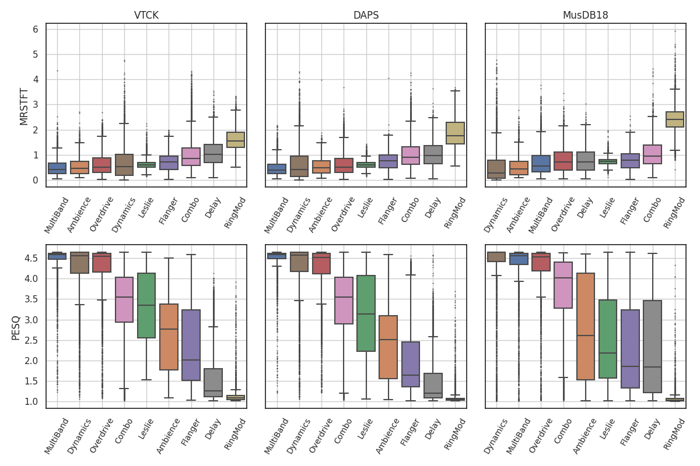
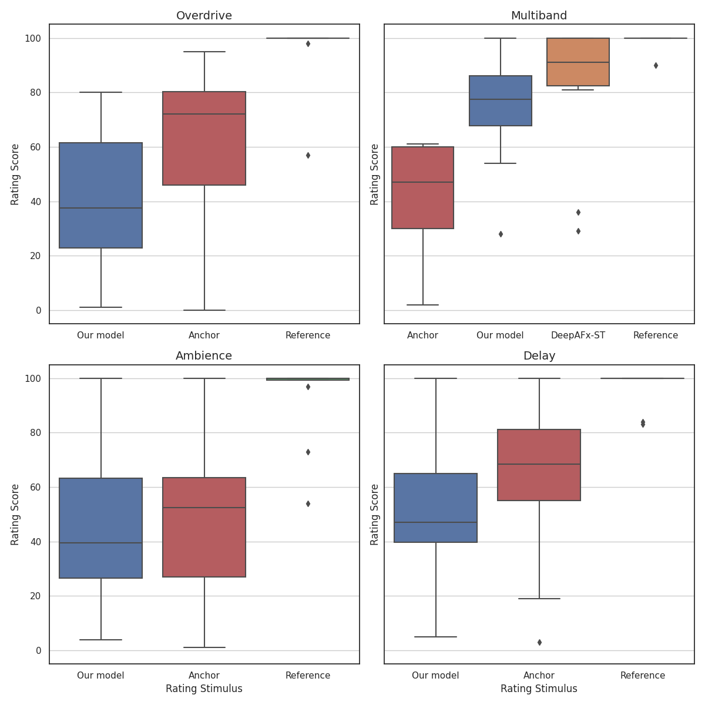

## What I've done this week
- Performed offline evaluation of style-transfer model.
  - Calculated multi-resolution STFT (MRSTFT) error and perceptual evaluation of speech quality (PESQ) metrics for VTCK, DAPS and MusDB18 datasets using 9 different DAFX.
  - More useful as a judgement of comparable perceptual performance between DAFX types since we do not have a baseline.
  - Results can be seen in Figure 1.
- Started getting participants for MUSHRA evaluation.
  - 5 participants so far, however one of them just rated everything 100 for all trials, so I've removed those datapoints.
  - Summary of results so far from the 4 other participants are shown in Figure 2.
- Much of the rest of the week has just been spent working on the final report.

## Questions

- I'm aiming to have a (very) rough draft of the final report done by the middle of next week. Would it be possible to get some high-level feedback if I were to send it to you both?

## Plan for next week

- Rough draft of report.

## Current state of project

- Mostly report writing and analysis of evaluation results left to do. 

\pagebreak
# Dataset Evaluation

|
| :--: |
| **Figure 1**: MRSTFT and PESQ scores across VTCK, DAPS and MusDB18 datasets. Lower is better for MRSTFT, higher is better for PESQ.

\pagebreak
# MUSHRA Evaluation

|
| :--: |
| **Figure 2**: MUSHRA results so far from 4 participants.
