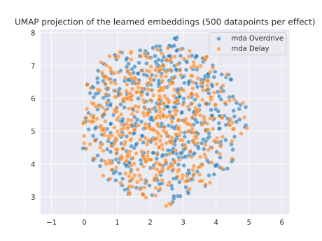

## What I've done this week
- Summarised *Bridging Audio Analysis, Perception and Synthesis with Perceptually-Regularized Variational Timbre Spaces (2018)*.
  - Short summary and takeaways below.
- Simplified VAE training to try to debug issues discussed last week.
  - Only using 2 effects that are quite different (overdrive and delay).
  - Only using a single parameter setting for both effects (manually verified that the setting is sensible).
  - Found that model weights for the pre-trained audio encoder were *not* being loaded properly in previous runs. However, the figures show that fixing this bug does not improve the structure of either the latent space or the projection of the audio embeddings much.
  - Ran a longer training run (~50 epochs) and logged audio embeddings and AudioCommons features for analysis. 
  - See figures below for more details.
- Also performed a longer training run without using the AudioCommons feature extractor. This brought the run time for an epoch down from ~6 mins to ~15 seconds, hence I was able to train the VAE for much longer (500 epochs) with a smaller learning rate (3e-4 $\rightarrow$ 1e-5) to monitor how loss progressed.
  - One issue found is that the average absolute value for the audio encodings is ~7e-3. The best RSME after training for 500 epochs was ~4e-3 for the training set and ~5e-3 for the validation set. That is, the reconstruction seems to be quite poor.
  - W&B logs for this training run available here: [https://api.wandb.ai/report/kieran-grant/pnog3som](https://api.wandb.ai/report/kieran-grant/pnog3som).
- Created an initial (very high level) model evaluation plan.
  - Attached below.
- Began working on final report.
  - So far just moving parts of interim report which are relevant.

## Questions
- Any feedback on the initial evaluation plan would be appreciated! Anything you think I should add? Or if I should compare my approach against more than just the DeepAFX-ST model (which my model is based on)?
- The relatively poor reconstruction loss and lack of structure in both the audio embeddings and learned latent embeddings seems to be an issue. Do you have any guidance or advice for further debugging that could be performed?

## Plan for next week
- Further debugging of VAE.
- An even longer training run (without AudioCommons features).
- Continue to work on sections of the final report which I can write at the moment.

## Current state of project
- Slightly concerned at the lack of structure in both latent space and embeddings of audio - worried that there isn't a lot of time remaining in the project considering end-to-end training needs to be performed and experiments conducted.
- I think writing out the evaluation plan has been useful for solidifying the scope and aims of the project.

\pagebreak
# Initial Evaluation Plan

## Style Transfer
- Use unseen speech and music audio datasets.
- Use both seen and unseen DAFX.
- Generate effected audio and store parameter settings used.
- Measure MAE between estimated and actual parameter settings after model performs style matching.
- Also measure difference in perceptual losses (MFCCs, Multi-scale spectral loss etc.) on effected/resultant audio.
- Compare against DeepAFX-ST [1] for perceptual losses.
- Also perform experiment with an audio source that has an unknown DAFX applied (speech with natural reverb, guitar with a particular pedal effect applied) - can compare this with DeepAFX-ST. We would expect our approach to be better on effects that are not reproducible by DeepAFX-ST such as delay and modulation.

## Use of latent space for high-level parameter adjustment
- Interpolate between points in latent space and observe changes to parameter settings/effected audio. Maybe show mel-spectrograms across a grid?
- Measure changes in AudioCommons features. E.g. does moving along a single axis change *depth* but leave other features mostly unchanged?

## References
[1] Steinmetz, Christian J., Nicholas J. Bryan, and Joshua D. Reiss. "Style transfer of audio effects with differentiable signal processing." *arXiv preprint arXiv:2207.08759 (2022)*.

\pagebreak
# Bridging Audio Analysis, Perception and Synthesis with Perceptually-Regularized Variational Timbre Spaces (2018)

## Short Summary

One aim of music perception research is to understand perceptual differences between instruments by constructing timbre spaces. These are based on dissimilarity ratings between pairs of instruments gathered from human subjects which are then transformed using techniques such as Multi-Dimensional Scaling (MDS). While these derived timbre spaces can provide insight into perceptual timbral similarities between instruments, the spaces must be recalculated for each new datapoint. Also, these mappings are not invertible, meaning they cannot be used to generate novel timbral data.

In this paper, the authors present a method of training a Variational Autoencoder (VAE) which is regularised by these timbre spaces in order to be able to map new instruments into the latent space, generate novel sounds and interpolate between instrument families. The authors present 3 different regularisation techniques: using Euclidean distance between latent datapoints and corresponding points in the timbre space, using a distance metric between pairs of datapoints and the derived Guassian distribution of similarity ratings between those pairs of instruments, and finally using a class-based prior using the distribution of class labels in the target timbre space.

PCA is used to analyse the derived latent spaces using each regularisation method. Using any of the three regularisation techniques above are shown to improve the dissociation of instrument distributions. However, the regularisation does not make any significant difference to the reconstruction of the audio. 

The learned latent spaces are then used for a series of classification tasks (instrument, family, pitch and dynamic). In this case it is found that the Guassian prior achieved highest accuracy for family and dynamics, the class-prior regularisation achieved the highest accuracy for pitch classification and the vanilla VAE performed best for instrument classification - indicating that perceptual information can potentially blur discrimination of highly similar instruments (violin and violincello for example).

The authors demonstrate the generative capabilities of the model by evaluating audio reconstructions from a test set - it is found that the Euclidean regularisation created too strong of an effect on the latent space, affecting the generalisation of the model. Finally, the authors consider the perceptual inference of unseen instruments. In this case, some instruments are encoded in a more coherent way than others (piccolo and viola group with their families, whereas harp and guitar are encoded quite far apart).

## Takeaways
- I think the use of a prior space to regularise the learned latent space is very interesting, and something I have not seen in other deep learning with audio applications.
- I had also not heard of MDS or timbre spaces before, I would be interested if a similar use of ratings of similarities for audio transformations could be possible and whether these could be labelled with semantic descriptors.
- I liked that the authors performed several different evaluations on the latent space, though most seemed quantitative and were a little bit shallow in terms of analysis (e.g. the latent embeddings of out-of-dataset instruments is interesting, however the authors only use 4 different instruments and don’t explain why some embed in non-straightforward ways).

\pagebreak
# Visualisations

|
| :--: |
| **Figure 1**: UMAP 2D projection of feature embeddings of 25,000 examples of clean input audio (no effect applied).

|
| :--: |
| **Figure 2**: UMAP 2D projection of feature embeddings of 25,000 examples of effected reference audio (either overdrive or distortion applied).

|
| :--: |
| **Figure 3**: UMAP 2D projection of the difference of the input and reference audio embeddings.

|
| :--: |
| **Figure 4**: Difference in AudioCommons *brightness* and *depth* between input and reference audio with overdrive or delay applied.

|
| :--: |
| **Figure 5**: UMAP 2D projection of the learned latent space after 50 epochs of training (25,000 samples) for 500 datapoints of effected audio for each effect.
