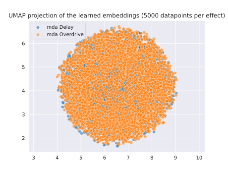
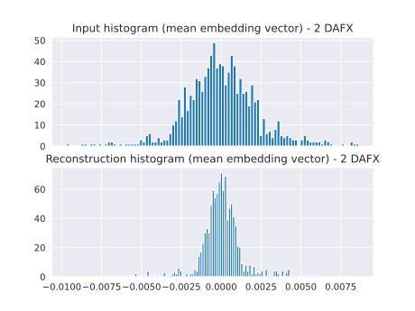

## What I've done this week
- Spent most of the week debugging and verifying my current model and data.
  - Found a couple of small issues with how data was being preprocessed which seemed to effect how the audio encoder performed.
  - Re-ran a longer training run (250 epochs) with 2 DAFX to gather audio feature embeddings. Visualisations of these are below.
  - Here are the logs of the same training run: [https://api.wandb.ai/report/kieran-grant/bmknfzey](https://api.wandb.ai/report/kieran-grant/bmknfzey).
  - Embeddings seem to have a much better structure based on Figures 1 and 2. However, there is still a lot of overlap.
  - Performed an additional training run with 6 DAFX to see if there was similar separation of embeddings between effects. These are shown in Figures 4 and 5.
- Unfortunately the performance of the VAE has not improved with these better embeddings, and the latent space is still quite unstructured as seen in Figure 3.
  - I tried using the difference of the clean and effected embeddings to train the VAE rather than concatenating the embeddings. I also increased the dimension of the latent space to 256 from 64.
  - Reconstruction loss (RMSE) is still very poor (~0.003 on the training set, where the mean-absolute value of the input vector is ~0.002). 
  - I plotted histograms of values for the mean input and reconstruction vectors with 10,000 samples in Figure 6 - it looks as though the reconstruction values tend to be in a much smaller range than the input values.
- Spent a bit of time trying to implement a simple VAE for spectrograms.
  - Had some trouble reconstructing the correct image shape from latent space. I'm using convolution layers to try to reduce the dimensionality of the image before the fully-connected layers embed the image into the latent space - but think the stride I am using (~3 for most layers) is causing some issues when reversing the operation.
  - Will do a bit more reading to see where I might be going wrong with this.

## Questions
- Grade/feedback for interim report has not appeared on Moodle/SOCS website - would it be possible to double check the submission?
- I think I should have clarified the intention of creating a simplified VAE for spectrograms:
  - This spectrogram VAE should encode a spectrogram and be able to decode from the latent space to a reconstructed spectrogram.
  - Is the idea that this VAE would be pretrained on the dataset (with both effected and uneffected audio with a number of DAFX), then the encoder part used to replace the pretrained audio encoder that I am currently using?
  - Would there be any benefit in the above, rather than just training the encoder part end-to-end alongside the VAE in the model?

## Plan for next week
- Finish implementing spectrogram VAE and train.
- Continue debugging model.

## Current state of project
- Not much progress from last week, continuing to debug the model to improve the performance of the VAE.

# Visualisations

|
| :--: |
| **Figure 1**: UMAP 2D projection of difference in feature embeddings (clean/effected) with 2 DAFX.

|
| :--: |
| **Figure 2**: UMAP 3D projection of difference in feature embeddings (clean/effected) with 2 DAFX.

|
| :--: |
| **Figure 3**: UMAP 2D projection of latent space embeddings of 5,000 samples per DAFX after training with 2 DAFX.

|
| :--: |
| **Figure 4**: UMAP 2D projection of difference in feature embeddings (clean/effected) with 6 DAFX.

|
| :--: |
| **Figure 5**: UMAP 3D projection of difference in feature embeddings (clean/effected) with 6 DAFX.

|
| :--: |
| **Figure 6**: Histograms comparing the values of the mean input and reconstruction vectors across 10,000 samples (2 DAFX).