## What I've done this week
- Included a new, simpler dataset: the VTCK speech dataset ([https://datashare.ed.ac.uk/handle/10283/2950](https://datashare.ed.ac.uk/handle/10283/2950)) to help with debugging.
- Plotted UMAP projections of spectrograms directly.
  - Figures are included in **Table 1** below.
  - VTCK dataset is clearly better at separating effect classes. Though still gets a little bit messy with more than 3 different types of DAFX (might also be due to fewer spectrogram samples per effect when plotting more than 3 effects).
- Finished implementation of Spectrogram VAE.
  - Started a new repository for this: [https://github.com/kieran-grant/Level5ProjectAudioVAE](https://github.com/kieran-grant/Level5ProjectAudioVAE).
  - Simple convolution network with 3 convolution layers and a single fully connected layer to map to latent space.
  - Performed a long test training run on VTCK dataset with no DAFX applied (raw audio).
  - Logs for training run can be found here: [https://api.wandb.ai/links/kieran-grant/k15my1j5](https://api.wandb.ai/links/kieran-grant/k15my1j5).
  - Example spectrogram reconstructions from trained model are shown in **Figure 1**.
  - It looks as though the reconstruction is similar no matter what the input (i.e. it is predicting an average of the dataset)
- I did some more investigation into the poor Spectrogram VAE reconstruction using the MNIST dataset with my VAE.
  - The issue might be the inclusion of the KLD in the loss function (or weighting it too highly).
  - This can clearly be seen in the differences of reconstructions between **Figure 2** and **Figure 3**.
  - The inclusion of the KLD results in predicting an average image for any input, whereas excluding this part of the loss results in much better reconstructions.
- Continued working on final report between tasks.

## Questions
My reconstruction loss has been poor in both implementations of the VAE. I was wondering if there was potentially something I'm doing wrong in my implementation - particularly with regards to the KL-Divergence. I am calculating my loss as: 

$$Loss = MSE + \beta \cdot KLD$$

Implementation-wise, I am averaging over batch size. So I have something like the following:

---

```
import torch
import torch.nn.functional as F

...
# calculate recon loss using mean reduction
recon_loss = F.mse_loss(x, x_hat, reduction="mean")

# calculate kld for batch, then mean over batch
kld_batch = -0.5 * torch.sum(1 + log_var - torch.square(mu) - torch.exp(log_var), dim=1)
kld = torch.mean(kld_batch) 

# calculate total loss
loss = recon_loss + (self.hparams.beta * kld)
```

--- 

Where:

- `x` is the batch of original (normalised) spectrograms (`shape = (batch_size, num_channels, width, height)`).
- `x_hat` is the reconstructed spectrogram.
- `mu` and `log_var` are the outputs of the mapping networks to the latent space (`shape = (batch_size, latent_dim)`).

***Is there anything obviously wrong in this implementation of the VAE loss? Or is it purely a case of performing hyperparameter tuning on the $\beta$ value?***

## Plan for next week
- Revisit Spectrogram VAE architecture to improve reconstruction loss.
- Train on variety of DAFX and both datasets.
- Visualisations of reconstructions and latent embeddings.

## Current state of project
- Still working on creating sensible embeddings of audio which reflect the difference in effects.
- Working on final report during model training etc.

\pagebreak
# UMAP Visualisations

**MusDB18 (Music) Dataset**    |  **VTCK (Speech) Dataset**
:-------------------------:|:-------------------------:
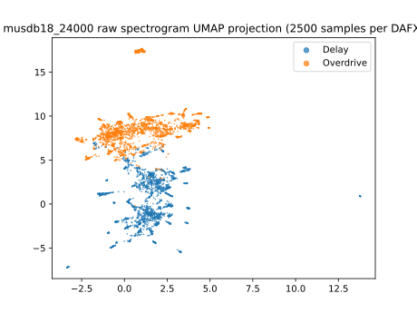{width=50%}  |  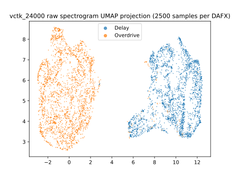{width=50%}
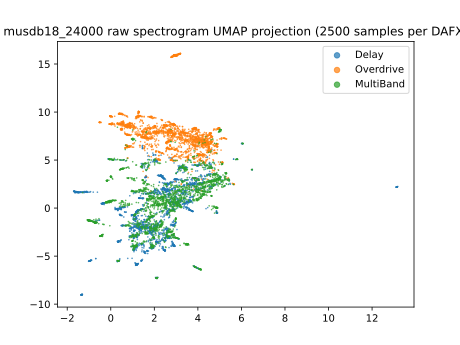{width=50%}  |  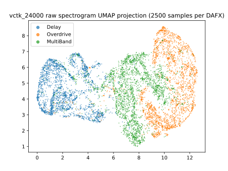{width=50%}
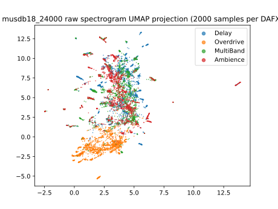{width=50%}  |  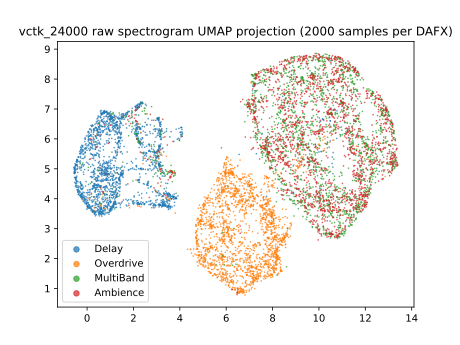{width=50%}
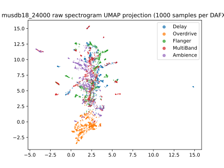{width=50%}  |  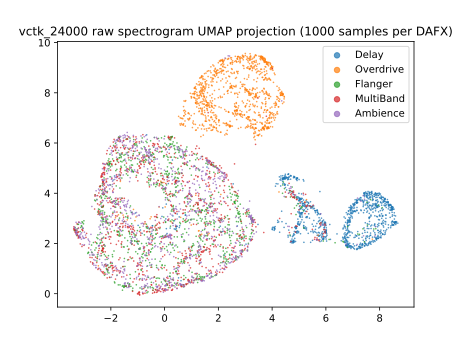{width=50%}

|[]()
| :--: |
| **Table 1**: UMAP 2D projections of raw spectrograms from MusDB and VTCK datasets using various numbers of DAFX.

\pagebreak
# Spectrogram Reconstruction

|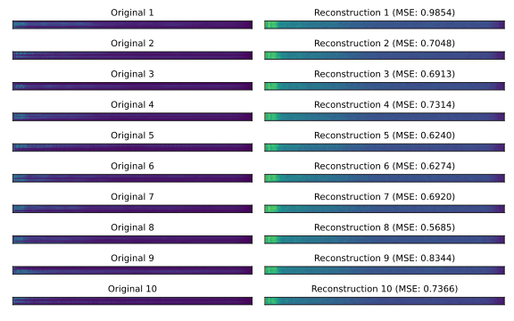
| :--: |
| **Figure 1**: Example reconstruction of spectrograms for model trained on VTCK dataset for 200 epochs - checkpoint is model that achieved the best validation loss (at epoch 187).

\pagebreak 
# MNIST Reconstruction

|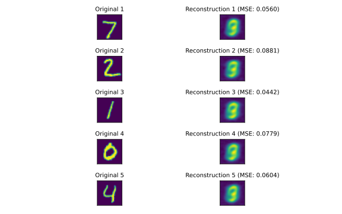
| :--: |
| **Figure 2**: Reconstruction of MNIST dataset with KLD included in loss ($\beta=1$).

|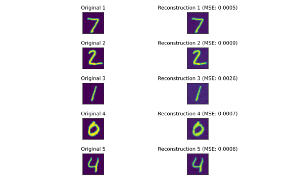
| :--: |
| **Figure 3**: Reconstruction of MNIST dataset with no KLD included in loss ($\beta=0$).

