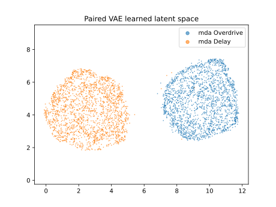
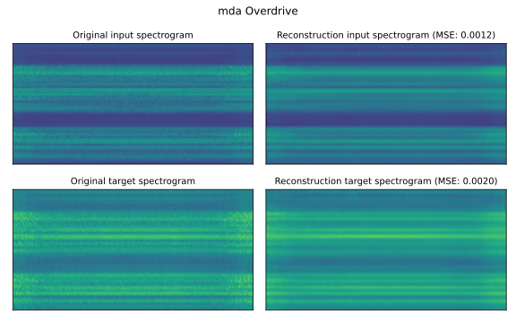
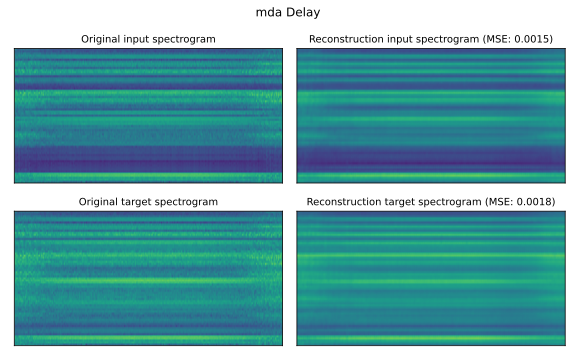
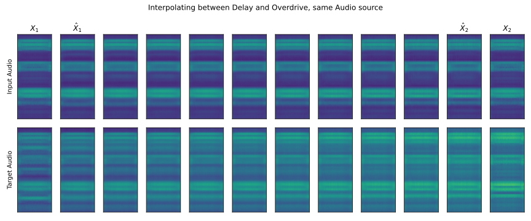
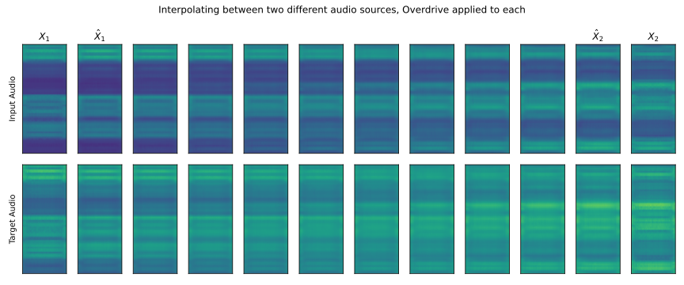

## What I've done this week
- Updated Spectrogram-VAE model to take joint input-target audio pairs, stacked across channels.
  - Implemented 2-channel version for Spectrogram without phase and 4-channel version for Spectrogram with phase.
  - Had some issues when training with 4-channel version, decided to use 2-channel version for now.
  - Updated loss to use sum rather than batch-mean. Makes tracking training less interpretable, but model seems to train better.
  - Trained Joint-Spectrogram VAE on VTCK dataset with Delay and Overdrive DAFX.
    - Train logs can be found here: [https://api.wandb.ai/links/kieran-grant/7i1uvtrs](https://api.wandb.ai/links/kieran-grant/7i1uvtrs)
    - Training quite unstable at beginning - however, stabilised after ~50 epochs.
    - I'm still not 100% sure why old loss was causing issues with KLD-loss. Still used a very small $\beta$ value (0.0001) for Spectrogram-VAE training.
  - Reconstructions (**Figures 2** and **3** below) and latent space clustering (**Figure 1**) look promising.
  - Performed interpolation for audio and DAFX with learned model, results look sensible (**Figures 4** and **5**).
- Started implementation of simple end-to-end system, without bottleneck.
  - i.e. mapping joint embedding from Spectrogram VAE to DAFX parameters directly with a simple linear network.
  - Loss uses combination of Multiresolution STFT loss and L1 loss directly on audio as well as tracking DAFX parameter settings.
  - Created callback to store input/reference/prediction audio on W&B.
  - Ran short training session, had some issues with predicting correct settings with dummy values - will look more into this next week.

## Questions
- Now that I have a simple trained Spectrogram-VAE - I'm wondering about the best method to map this down to a low dimensional (2-8D) latent space that can be 'played with' to find similar parameter settings. Would UMAP work, or should I have another bottleneck in a linear network and use similar sampling/KLD as in the autoencoder before mapping to parameter settings?

## Plan for next week
- Debug end-to-end system.
- Implement latent bottleneck for controller network.

## Current state of project
- Spectrogram VAE looks like it is performing a little better, should hopefully unblock me for the moment so I can work on the controller network.

\pagebreak
# Joint-Spectrogram VAE Visualisations

|
| :--: |
| **Figure 1**: Learned latent space of Joint-Spectrogram VAE (2,000 samples per DAFX).

|
| :--: |
| **Figure 2**: Reconstruction of Overdrive DAFX.

|
| :--: |
| **Figure 3**: Reconstruction of Delay DAFX.

\pagebreak
|
| :--: |
| **Figure 4**: In this figure $X_i$ is the original spectrogram and $\hat{X}_i$ is the reconstruction from $z_i$ (the latent embedding of $X_i$). The top row represents the 1st channel of the spectrogram (clean, uneffected audio) and the bottom row is the 2nd channel of the spectrogram (audio with DAFX applied). 
| 
| The spectrograms between $\hat{X}_1$ and $\hat{X}_2$ are generated from linearly interpolating between ${z_1}$ and ${z_2}$. Here, the audio source is the same for $X_1$ and $X_2$, however, $X_1$ has the Delay effect applied, while $X_2$ has the Overdrive effect applied (hence, ideally the top row should not change throughout the interpolation).

|
| :--: |
| **Figure 5**: As in **Figure 4**, however in this image we use two different audio sources and apply a single effect to each (Overdrive).