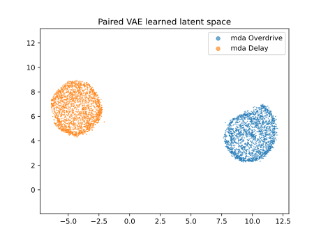
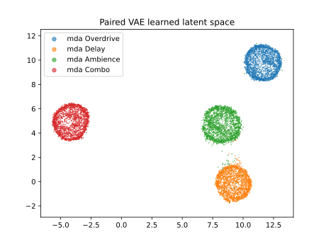
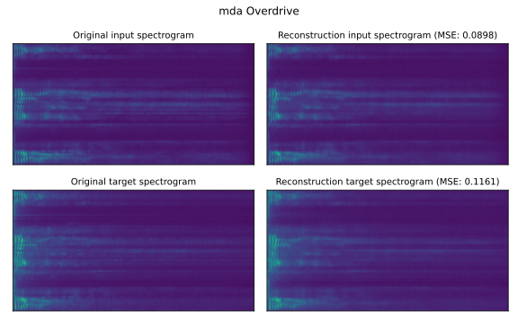
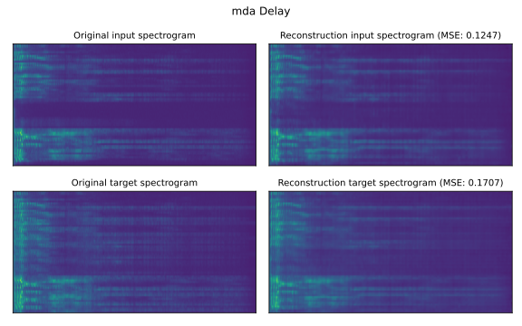
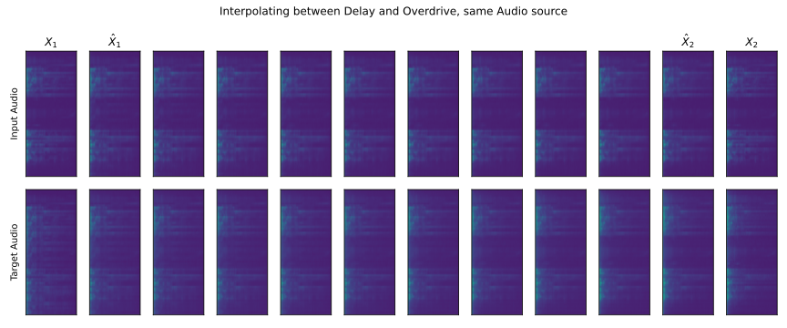
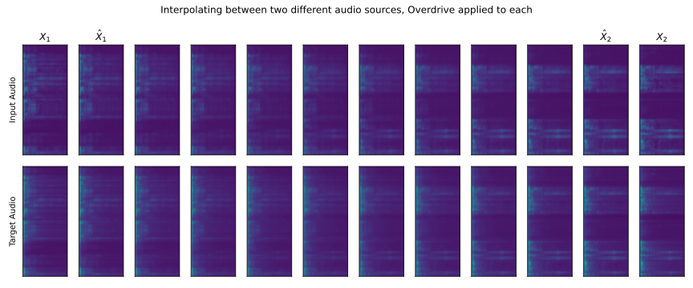

## What I've done this week
- Found issue with preprocessing of spectrograms when training Spectrogram VAE.
  - This meant having to retrain the VAE from scratch.
  - Training logs can be found here: [https://api.wandb.ai/links/kieran-grant/inzdnb7r](https://api.wandb.ai/links/kieran-grant/inzdnb7r)
  - Training is much slower than last weeks model. This is probably due to the (correctly calculated) spectrograms having more detail in them.
  - Reconstructions/latent space and interpolations are shown in **Figures 1-6**.

- Unfortunately, between model retraining and lots of coursework due, I've not managed to make a lot of progress with the project this week. 

## Questions
- I tried finding an inverse-STFT for magnitude spectrograms, but the only ones I could find (PyTorch, librosa etc.) required a complex-valued spectrogram. Are there any other methods you might be aware of for reconstructing audio from magnitude spectrograms?

## Plan for next week
- Use newly trained VAE for end-to-end training with static parameter settings.
- Visualise latent embeddings of different parameter settings with each effect.

## Current state of project
- Not much progress from state of project last week. Hoping to make more progress in the next week.

\pagebreak
# Joint-Spectrogram VAE Visualisations

|
| :--: |
| **Figure 1**: Learned latent space of Joint-Spectrogram VAE (2,000 samples per DAFX) - 2 DAFX.

|
| :--: |
| **Figure 2**: Learned latent space of Joint-Spectrogram VAE (2,000 samples per DAFX) - 4 DAFX.

|
| :--: |
| **Figure 3**: Reconstruction of Overdrive DAFX.

|
| :--: |
| **Figure 4**: Reconstruction of Delay DAFX.

\pagebreak
|
| :--: |
| **Figure 5**: Interpolating between two effects (same audio source) in latent space.

|
| :--: |
| **Figure 6**: Interpolating between two audio sources (both using Overdrive DAFX).