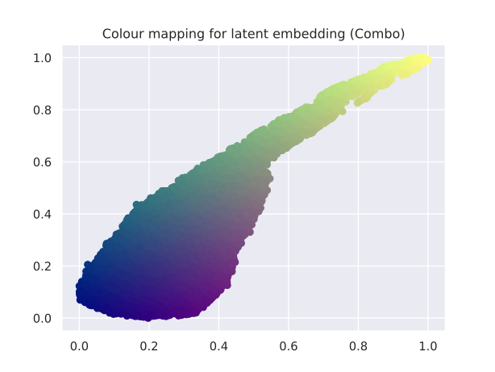

## What I've done this week
- Spent a little bit of time debugging a loss issue I was having with the end-to-end system.
  - Even when using fixed parameter settings and having the model always predict those settings, my loss was still not 0.
  - I found that this was due to some very slight differences in applying the effect during data generation vs applying effect during training (data generation applies a short linear fade after effect is applied etc.).
  - I don't think this is a big issue (but good to be aware of), and I don't think it's worth trying to change the preprocessing as this is what was used in VAE training.
- Ran end-to-end training with fixed parameter settings using the Overdrive DAFX.
  - Run report can be found here with some audio examples: [https://api.wandb.ai/links/kieran-grant/cl2vgb6q](https://api.wandb.ai/links/kieran-grant/cl2vgb6q)
  - Model predictions converge towards static parameters.
  - Interestingly, the model prediction was able to achieve slightly lower loss compared to always predicting the fixed parameters. This will probably be the model compensating for the small differences at the beginning and end of audio clips.
- Ran a second training run for the Overdrive DAFX where random settings are applied.
  - Run report can be found here with audio examples: [https://api.wandb.ai/links/kieran-grant/ru1rnf25](https://api.wandb.ai/links/kieran-grant/ru1rnf25)
  - It seems as though the model is able to predict pretty good parameter settings for style matching, model is also able to predict for a wide range of possible settings.
  - Some of the samples (with $P=0.1$) won't apply the effect at all. So the model also needs to learn to make the effect sound as 'clean' as possible.
- Started training run with Delay using fixed settings.
  - Run report can be found here with audio examples: [https://api.wandb.ai/links/kieran-grant/7yfke3o4](https://api.wandb.ai/links/kieran-grant/7yfke3o4)
  - Unfortunately, the model seems very sensitive to initial conditions. E.g. if the predicted parameter settings at the beginning of training are very close to 0 or 1, the model doesn't seem to be able to get out of this hole - which what happens in this run.
- Created visualisations of interpolating between individual parameter settings for 4 DAFX - the 2 used in training (Delay and Overdrive) as well as an unseen effects (Ambience and Combo).
  - These are shown in **Figures 1-8**
- Also performed the suggested domain colouring, where parameter settings are coloured based on their mapping in the latent space for the same 4 DAFX.
  - These are shown in **Figures 9-16**

## Questions

- Do you have any thoughts on the sensitivity to the initial conditions of the model? Is there some initialisation of weights which could help prevent something like that happening, or should I be clamping the output range more than just using sigmoid activation?

## Plan for next week
- Debugging the initial condition issue.
- End-to-end run with delay: static and random settings.
- Start implementation of low-dimensional space for parameter adjustment (using UMAP).
- Finalise evaluation plan.

## Current state of project
- End-to-end model seems to be able to learn parameter settings for Overdrive effect, need some more debugging for Delay.
- Feels as though I am nearing the end of the implementation phase of the project.

\pagebreak
# Interpolation of Parameter Settings

|
| :--: |
| **Figure 1**: Latent space when interpolating each Overdrive parameter setting individually.

|
| :--: |
| **Figure 2**: Latent space when interpolating each Overdrive parameter setting individually, separate plots for each parameter.

|
| :--: |
| **Figure 3**: Latent space when interpolating each Delay parameter setting individually.

|
| :--: |
| **Figure 4**: Latent space when interpolating each Delay parameter setting individually, separate plots for each parameter.

|
| :--: |
| **Figure 5**: Latent space when interpolating each Combo parameter setting individually.

|
| :--: |
| **Figure 6**: Latent space when interpolating each Combo parameter setting individually, separate plots for each parameter.

|
| :--: |
| **Figure 7**: Latent space when interpolating each Ambience parameter setting individually.

|
| :--: |
| **Figure 8**: Latent space when interpolating each Ambience parameter setting individually, separate plots for each parameter.

\pagebreak
# Domain Colouring 

|
| :--: |
| **Figure 9**: Colouring of Overdrive latent space.

|
| :--: |
| **Figure 10**: Pairplots showing pairs of Overdrive parameters coloured by mapping to latent space.

|
| :--: |
| **Figure 11**: Colouring of Delay latent space.

|
| :--: |
| **Figure 12**: Pairplots showing pairs of Delay parameters coloured by mapping to latent space.

|
| :--: |
| **Figure 13**: Colouring of Combo latent space.

|
| :--: |
| **Figure 14**: Pairplots showing pairs of Combo parameters coloured by mapping to latent space.

|
| :--: |
| **Figure 15**: Colouring of Ambience latent space.

|
| :--: |
| **Figure 16**: Pairplots showing pairs of Ambience parameters coloured by mapping to latent space.
