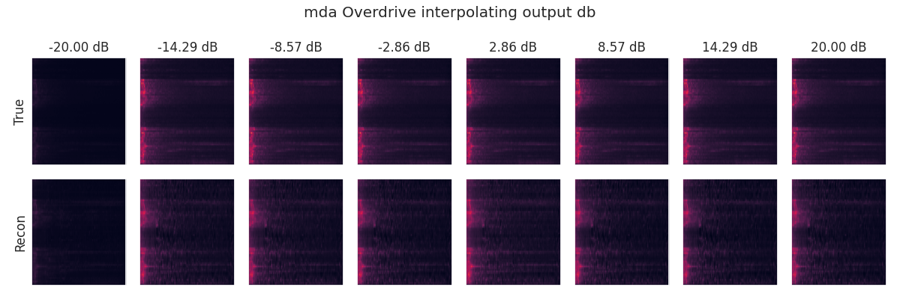
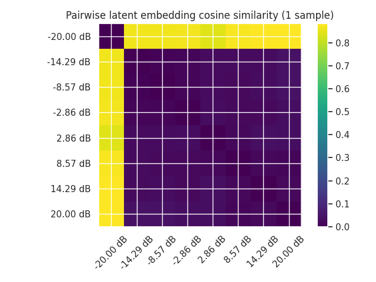
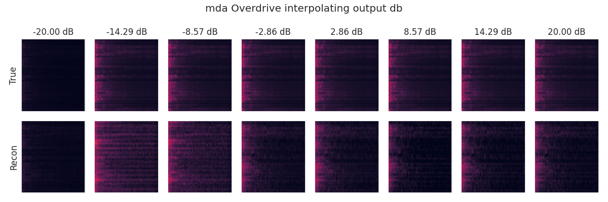
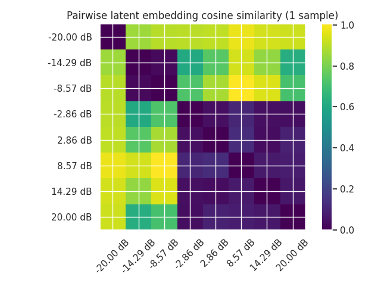
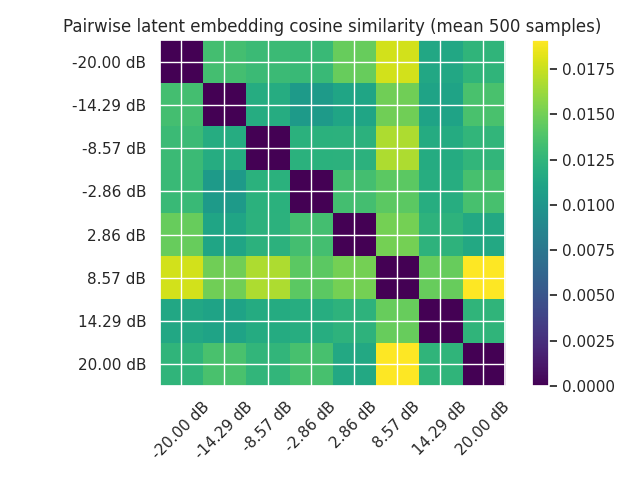

<!-- ---
title: Overdrive Analysis
author: Kieran Grant - 2357351G
geometry: margin=2cm
colorlinks: true

--- -->
## Code snippet for normalising spectrograms:

```
...
X = torch.stft(
            signal.view(bs, -1),
            n_fft=n_fft,
            hop_length=hop_length,
            window=window,
            return_complex=True,
        )

# Absolute value part
X_db = torch.pow(X.abs() + 1e-8, 0.3)
X_db_norm = X_db

# Normalise (0,1)
X_db_norm -= 0.3352797
X_db_norm /= 0.2745147
...
```

\pagebreak
## Interpolation of `output_db` setting for Overdrive DAFX

|
| :--: |
| **Figure 1**: Interpolating between -20dB and +20dB with spectrogram normalisation applied. True spectrogram is shown on the top row, reconstruction is shown on the bottom row. In this case, the spectrograms are all very similar.

|
| :--: |
| **Figure 2**: Cosine similarity of latent embeddings for the above interpolation.

|
| :--: |
| **Figure 3**: Interpolating between -20dB and +20dB with spectrogram normalisation applied for a different audio sample. True spectrogram is shown on the top row, reconstruction is shown on the bottom row.

|
| :--: |
| **Figure 4**: Cosine similarity of latent embeddings for the above interpolation.

|
| :--: |
| **Figure 5**: Cosine similarity of latent embeddings averaged over 500 samples for each setting.
