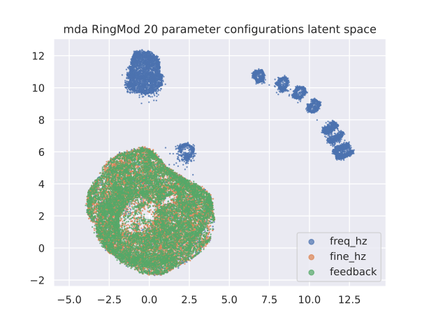
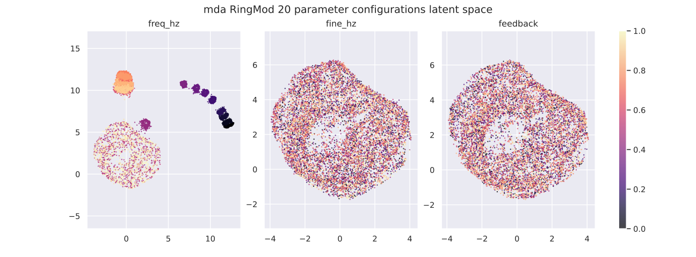
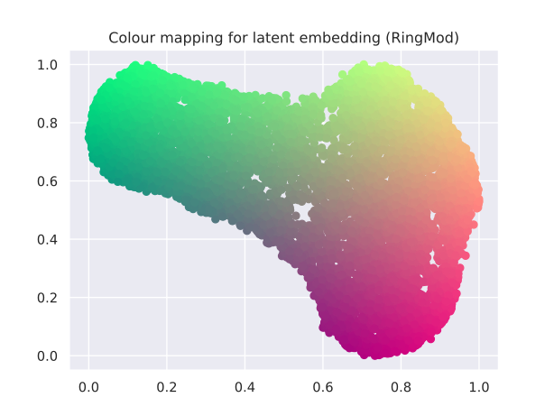
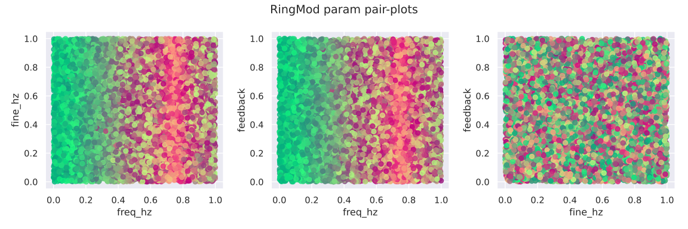

<!-- ---
title: RingMod Analysis
author: Kieran Grant - 2357351G
geometry: margin=2cm
colorlinks: true

--- -->

## Interpolation of Parameter Settings

|
| :--: |
| **Figure 1**: Latent space when interpolating each RingMod parameter setting individually.

|
| :--: |
| **Figure 2**: Latent space when interpolating each RingMod parameter setting individually, separate plots for each parameter.

\pagebreak
## Domain Colouring 

|
| :--: |
| **Figure 3**: Colouring of RingMod latent space.

|
| :--: |
| **Figure 4**: Pairplots showing pairs of RingMod parameters coloured by mapping to latent space.

