## What I've done this week

- Spent time debugging volume issue with spectrogram representation.
  - Found that using fixed normalisation constants for spectrograms may have been causing an issue.
  - Implemented new spectrogram calculation with per-image normalisation.
  - Unfortunately, this meant retraining the spectrogram VAE model.
- Retrained model with new spectrogram normalisation.
  - Trained with 4 different DAFX (Overdrive, Delay, RingMod, Dynamics (Compression)) using random parameter settings.
  - Trained for ~1200 epochs (20 hours)
  - Reconstructions are much better for each, however separation of effects in latent space isn't quite as good.
  - Performed some fine-tuning of the $\beta$-weighting for the last couple hundred epochs to balance reconstruction and KL losses - doesn't make a massive difference to structure of latent space.
    - See figures below - to avoid loads of images I've only included domain colouring and parameter interpolation for RingMod and Overdrive.
- Created an evaluation plan for the next few weeks.
  - Attached as a separate report.
- Continued working on final report between tasks.
- Also confirmed a professional audio engineer for some of the evaluation part of the project.

## Questions

- Any feedback on the evaluation plan would be appreciated.
- I am considering where to put the bottleneck in the end-to-end network for DAFX parameter adjustment. At the moment, I am thinking of using UMAP on the latent embeddings of the VAE and mapping down to a 2D plane (like the latent visualisations I've been making) where the user can then move around this space. Then using the inverse transformation to get a slightly different latent embedding which (should) map to some different parameter settings.
  - Do you think this sounds like a sensible plan?
- Currently, the structure of the embeddings don't look great. However, with the amount of tasks still to be done, I'm wondering if it's worth spending any more time trying to improve them, or whether I should move on to end-to-end training and evaluation with what I have? 

## Plan for next week

- Train end-to-end networks with each of the 4 seen effects as well as 3 unseen effects.
- Implement low-dimensional parameter adjustment latent space.
- Start preparing scripts for evaluation.
- Continue report writing.

## Current state of project

- Having an evaluation plan has helped me get a picture of what is left to be done.
- Would like to get end-to-end training/analysis and low-dimensional control space implementation done in the next couple of weeks so I can begin the evaluation phase.

\pagebreak
# Latent Embeddings of Effects

|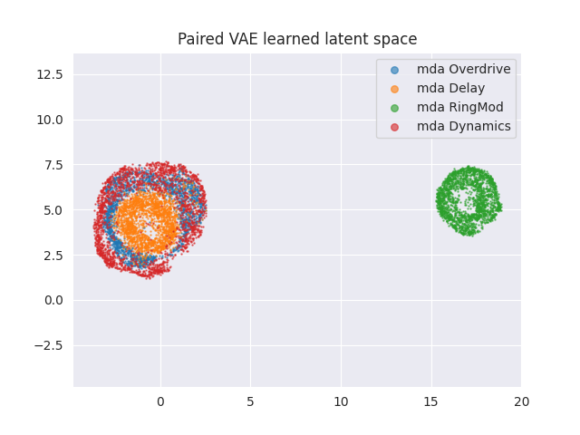
| :--: |
| **Figure 1**: Latent embedding of 4 DAFX ($\beta$=0.05).

|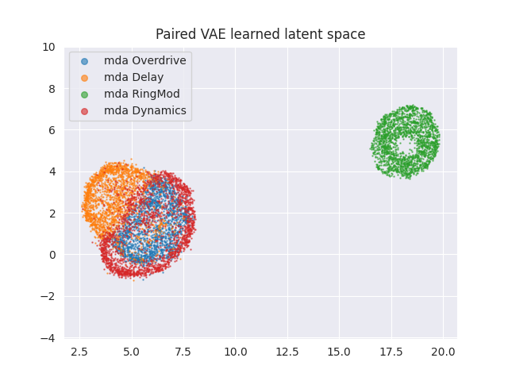
| :--: |
| **Figure 2**: Latent embedding of 4 DAFX ($\beta$=2.0).

|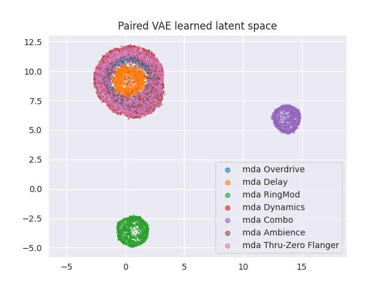
| :--: |
| **Figure 3**: Latent embedding of 7 DAFX ($\beta$=0.05)

|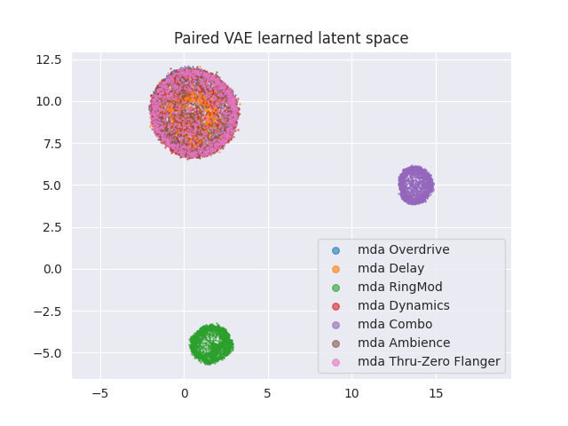
| :--: |
| **Figure 4**: Latent embedding of 7 DAFX ($\beta$=2.0)

\pagebreak
# Interpolation of Parameter Settings

|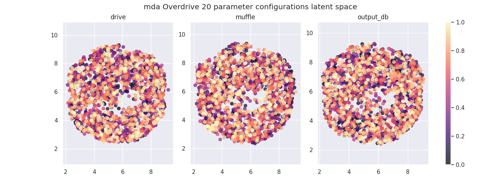
| :--: |
| **Figure 5**: Parameter interpolation for Overdrive ($\beta$=0.05).

|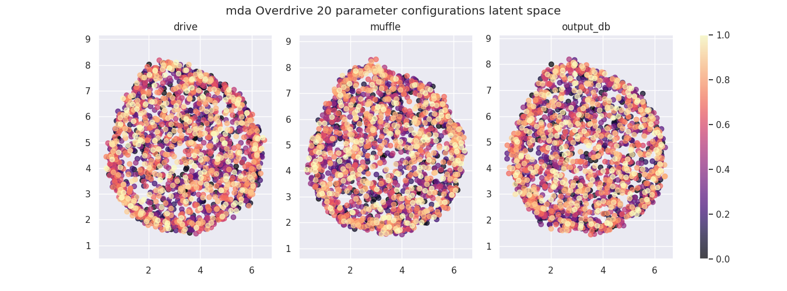
| :--: |
| **Figure 6**: Parameter interpolation for Overdrive ($\beta$=2.0).

\pagebreak
|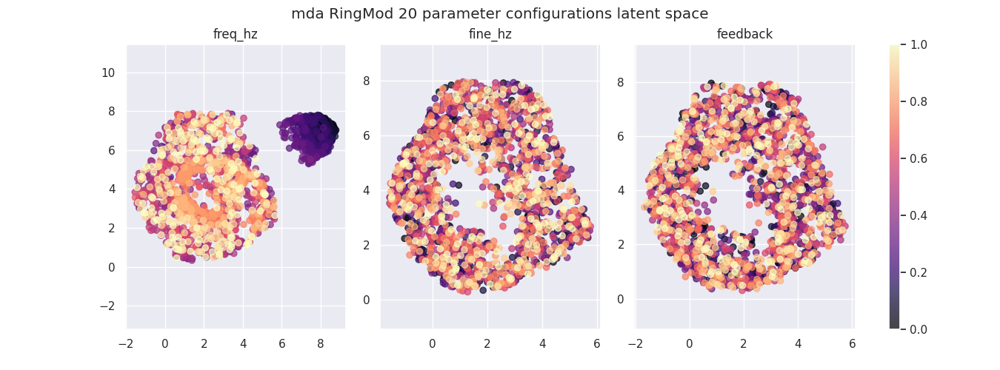
| :--: |
| **Figure 7**: Parameter interpolation for RingMod ($\beta$=0.05).

|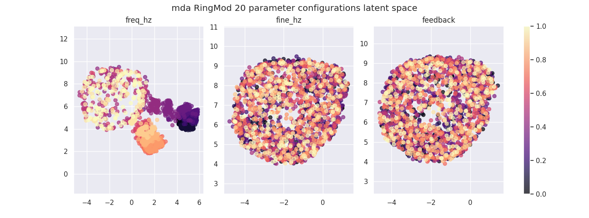
| :--: |
| **Figure 8**: Parameter interpolation for RingMod ($\beta$=2.0).

\pagebreak
# Domain Colouring 

|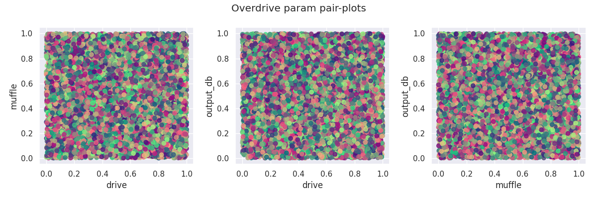
| :--: |
| **Figure 9**: Domain colouring pair-plot for Overdrive ($\beta$=0.05).

|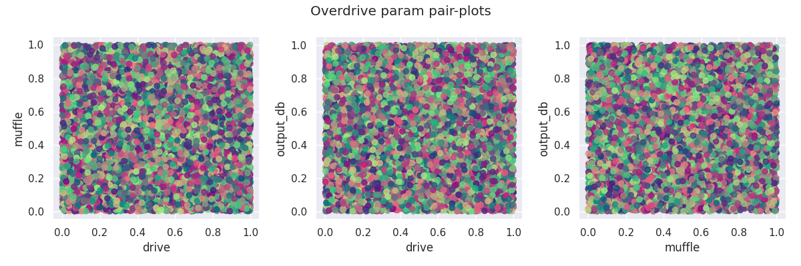
| :--: |
| **Figure 10**: Domain colouring pair-plot for Overdrive ($\beta$=2.0).

\pagebreak
|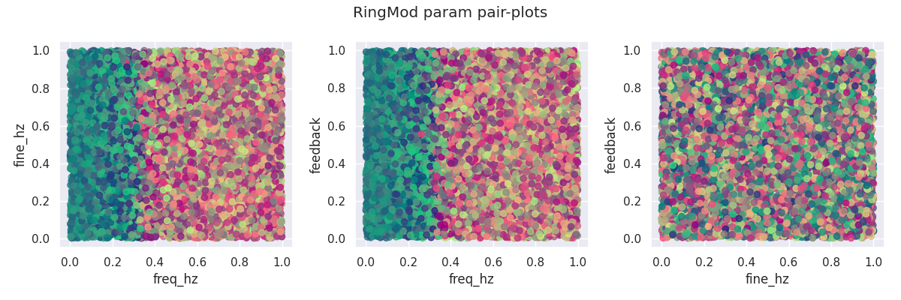
| :--: |
| **Figure 11**: Domain colouring pair-plot for RingMod ($\beta$=0.05).

|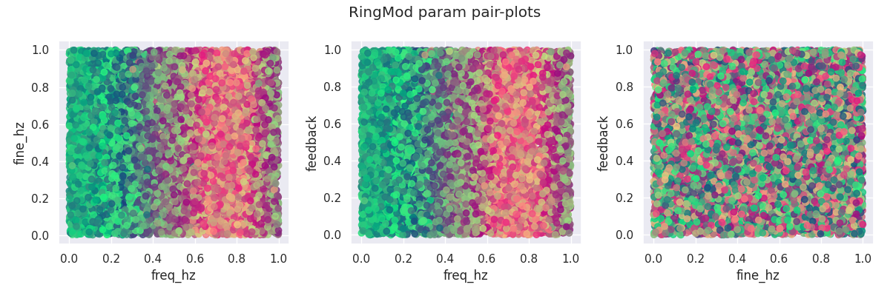
| :--: |
| **Figure 12**: Domain colouring pair-plot for RingMod ($\beta$=2.0).

