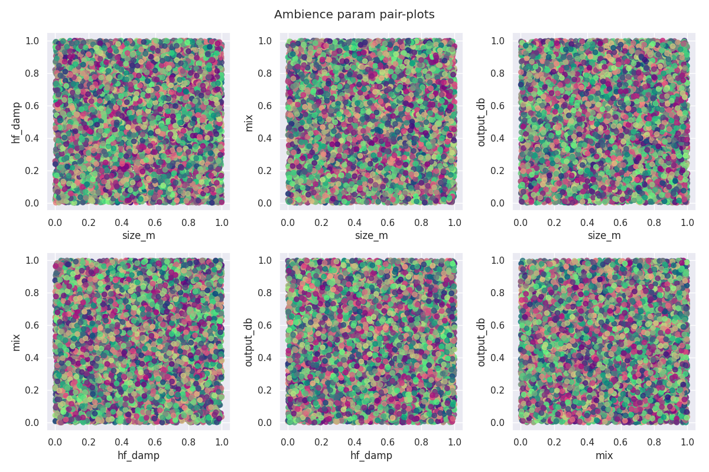

## What I've done this week
- Modified Spectrogram-VAE implementation to reconstruct a single spectrogram for use within a Siamese network.
  - I have also reduced the size of latent space (trialling 32 to 256 dimensions).
  - I was having some issues with balancing KL-divergence with reconstruction, so I implemented some scheduling to the $\beta$ value during training.
    - New implementation uses cosine cyclic-annealing for $\beta$ weight [1] with a prime cycle length.
  - Performed ~16 training runs in total. 
    - Noticed an issue with models which were trained with higher max-$\beta$ values ($\beta$ > ~1e-3) which resulted in low KL-divergence. One of which (~800 epochs) achieved reasonable structure to 256D latent space for differentiating effects (see **Figure 1**), but had strange doughnut-like structure for all effects when interpolating parameters (see **Figure 2**). 
      - Logs available here: [https://api.wandb.ai/links/kieran-grant/zcre1v21](https://api.wandb.ai/links/kieran-grant/zcre1v21)
    - Tried reducing the window size of STFT to get more detail in spectrograms and lowering the max-$\beta$ value.
      - Performed more training runs, but without lots of luck in improving the structure of the latent space.
      - Visualisations from the best performing model are shown in **Figures 3-13**.
- Started implementation of latent controller.
  - Using UMAP to map audio encoder latent space to 2D scatterplot for a given (fitted) end-to-end style matching network.
  - Currently, I am fitting UMAP to a large number of examples which roughly cover the latent space (e.g. ~10,000) parameter settings.
  - Rather than using the lossy inverse transform, when the user clicks on a point in the plot, the nearest datapoint is chosen, and the original vector recovered by storing indexes.
  - The original vector is then used to predict the DAFX settings (via the trained end-to-end network) and saves the transformed audio file which the user can listen to.
    - See **Figure 14** for interface in current state.

## Questions
- Do you know roughly when the project presentation will be?
- For the latent space controller, I was hoping to have an interface similar to the first 20 seconds of this video: [https://www.youtube.com/watch?v=E4I4gcOwuOk](https://www.youtube.com/watch?v=E4I4gcOwuOk). I.e. the user can just click on a datapoint and the audio automatically play. However, I'm not sure if something like this is possible with `matplotlib` or `plotly`? I've tried adding callbacks with `IPython.display`, but this doesn't seem to work.

## Plan for next week
- Finish implementing latent controller interface.
- Train end-to-end model for each effect.

## Current state of project
- Still pretty poor structure to latent space of Spectrogram-VAE, not sure if there is going to be any dramatic improvement in the next week before I have to move on the evaluation.

\pagebreak
# Low-KL Divergence Model

|
| :--: |
| **Figure 1**: Latent embedding of 4 DAFX with 256D latent space.

|
| :--: |
| **Figure 2**: Interpolating Delay parameter settings for model with very low KL-divergence.

\pagebreak
# Model with Best Latent Parameter Structure

|
| :--: |
| **Figure 3**: Latent embedding of 6 DAFX with 128D latent space.

\pagebreak
|
| :--: |
| **Figure 4**: Interpolating Ambience parameter settings.

|
| :--: |
| **Figure 5**: Domain colouring of Ambience parameters.

\pagebreak
|
| :--: |
| **Figure 6**: Interpolating Combo parameter settings.

|{ width=70% }
| :--: |
| **Figure 7**: Domain colouring of Combo parameters.

\pagebreak
|
| :--: |
| **Figure 8**: Interpolating Delay parameter settings.

|{ width=70% }
| :--: |
| **Figure 9**: Domain colouring of Delay parameters.

\pagebreak
|
| :--: |
| **Figure 10**: Interpolating Overdrive parameter settings.

|
| :--: |
| **Figure 11**: Domain colouring of Overdrive parameters.

\pagebreak
|
| :--: |
| **Figure 12**: Interpolating RingMod parameter settings.

|
| :--: |
| **Figure 13**: Domain colouring of RingMod parameters.

\pagebreak
# Latent Controller Interface

|
| :--: |
| **Figure 14**: Latent controller interface in current state.

## References 
[1] Fu, Hao, et al. "Cyclical annealing schedule: A simple approach to mitigating kl vanishing." arXiv preprint arXiv:1903.10145 (2019).